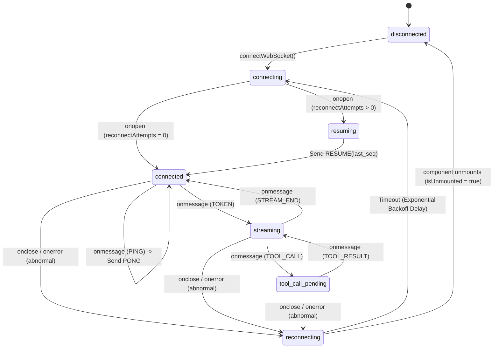
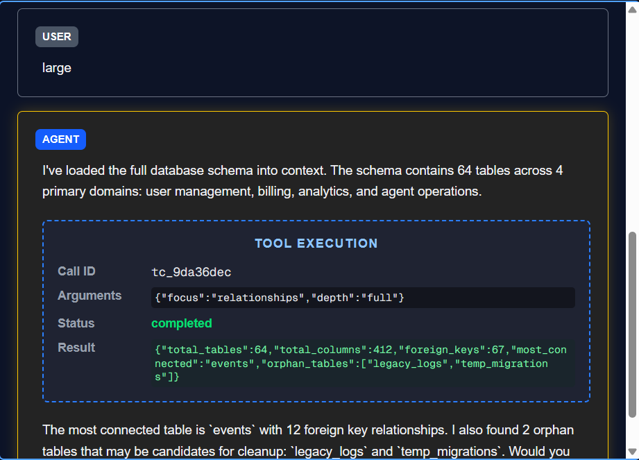
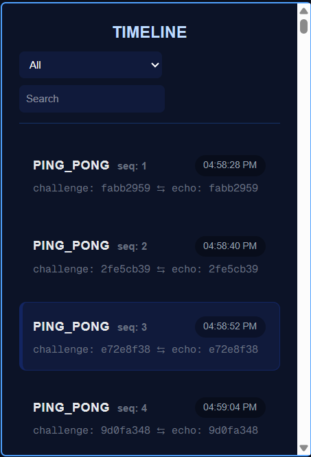
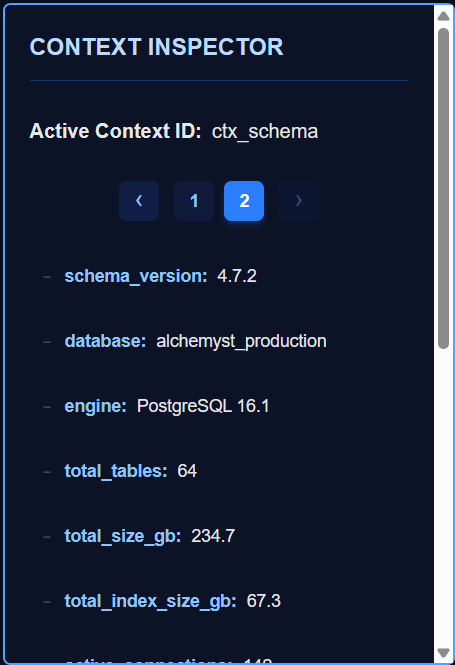
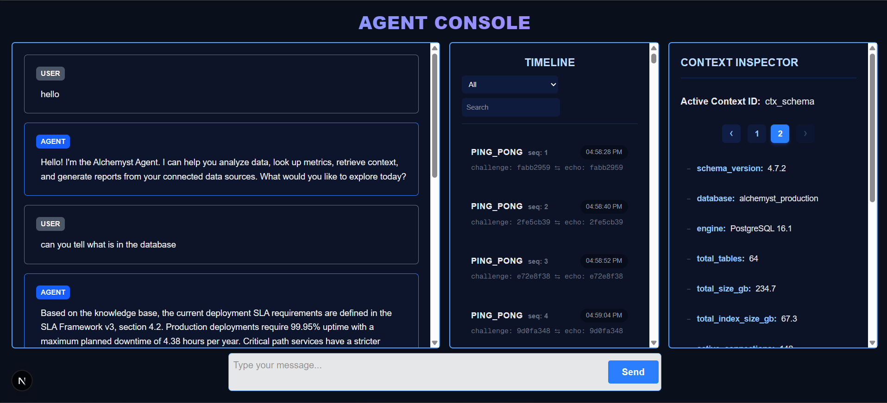

# README.md

## Architecture Summary
This frontend connects to a WebSocket server and processes messages as a continuous stream of events. To handle the unstable network (Chaos Mode), we implemented a buffer using a Map to catch out-of-order packets and a sequence tracker (`highestSeq`) to ensure UI updates happen in exact order. We also built an auto-recovery mechanism (NACK timeout) that automatically requests missing packets from the server if they get dropped, ensuring the chat never gets permanently stuck.

## WebSocket State Machine

Below is the state transition diagram of our client-side WebSocket lifecycle and stream states. It illustrates how the client manages handshakes, streams, tool block suspensions, and exponential backoff retry cycles:



## How to Run
1. Start the backend agent server:
   Navigate to agent-server directory and build/run the backend Docker container (https://github.com/Alchemyst-ai/hiring/tree/main/June-2026_FullStackAI/agent-server)
   ```bash
   cd agent-server
   docker run -p 4747:4747 agent-server --mode chaos
   ```
2. Start the frontend:
   ```bash
   cd frontend
   npm install
   npm run dev
   ```
3. Open `http://localhost:3000` in your browser.

## Screenshots and Media
*Please add your media files here:*
- **(a) Streamed response with a tool call**: 
- **(b) Trace timeline**: 
- **(c) Context inspector showing a diff**: 
- **(d) ChatInterface with Tabs**: 
- **Chaos Mode Screen Recording**: https://www.loom.com/share/11d22bfc16354bb9a81125fa06ad540e
